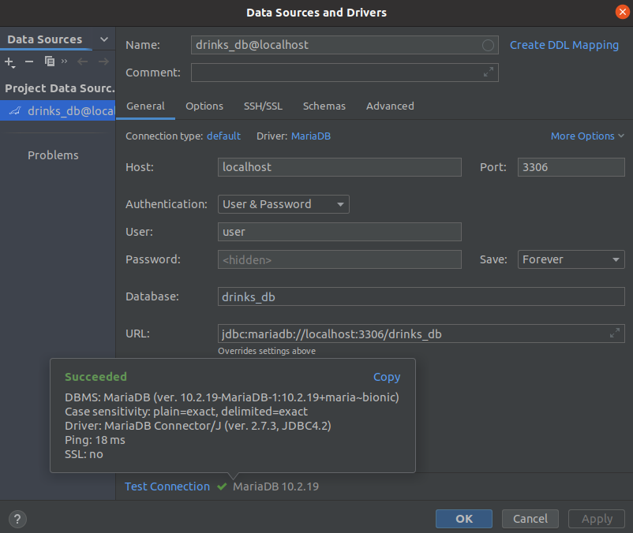

# jjdzr5-responsible-drinkers-web<br/><br/>

**Run container with:<br/>**
```docker-compose up -d```<br/>
or<br/>
```docker-compose up ```<br/>


**Stop container with:**<br/>
```docker-compose stop```<br/>
or<br/>
```docker-compose down```
<br/><br/>
**DB settings:<br/>**
```
DB_NAME=drinks_db
DB_USER=user
DB_PASSWORD=user
DB_HOST=localhost
DB_PORT=3306
DB_DRIVER=mysql
DB_HOST=mariadb
```
